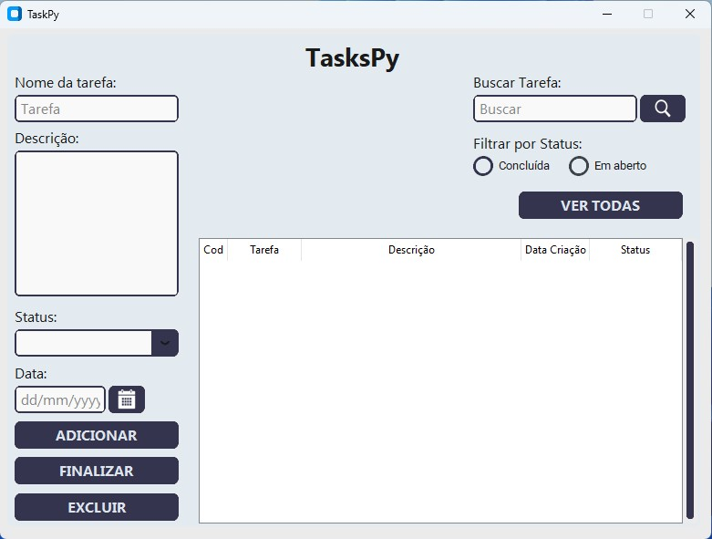

<h1>TasksPy</h1>
Todo List desktop desenvolvido utilizando lib Customtkinter que é baseada em tkinter.

  <h2>Imagem do sistema</h2>
  
  <h3>Objetivo do projeto</h3>
  
TasksPy é gerenciador de tarefas que tem por objetivo organizar de forma simples nossas tarefas do dia-a-dia. Possui uma interface intuitiva.

  <h3>Funcionalidades</h3>
  <ul>
    <li>Adicionar nova tarefa</li>
    <li>Exibir todas as tarefasa</li>
    <li>Exibir uma tarefa</li>
    <li>Exibir tarefa por status (Em aberto ou Concluída)</li>
    <li>Finalizar tarefa</li>
    <li>Excluir tarefa</li>

  </ul>
  <h3>Tecnologias Utilizadas</h3>
  

  
       
  <h3>Autor</h3>
  

    <a href="https://github.com/SilvaMarcosJoao">João Marcos.</a>

